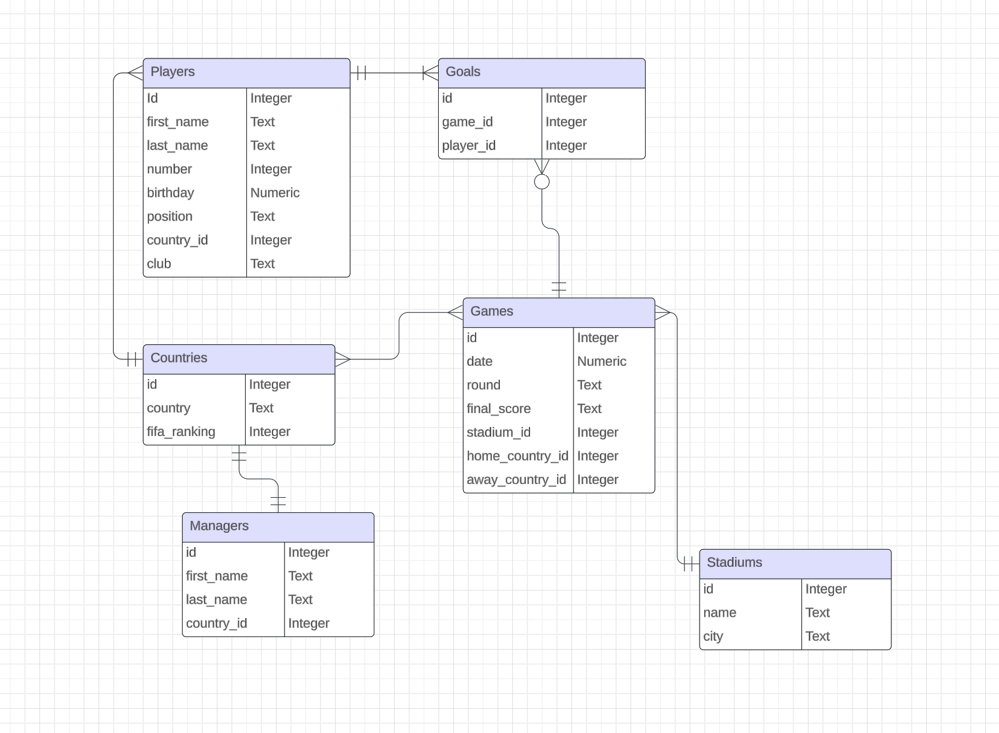

# Design Document

By Mahan Maalekian

## Scope

The database for UEFA Euro 2024 includes all entities necessary to track the progress of the 2024 Euro.
As such, included in the database's scope is:
* Countries participating in Euro 2024
* Players, including football-related indentifiying information
* Managers, including basic indentifiying information
* Stadiums, including their name and location
* Games, including their score, date, stadium and teams that played
* Goals, with the game it was scored in and the player who scored

Out of scope are elements like assists, in-game stats, and other non-core attributes.

## Functional Requirements

This databse will support:

* CRUD operations for the games played in Euro 2024
* Tracking the progress of the tournament, as well as the perfomance of teams and players

## Representation

Entities are captured in SQLite tables with the following schema.

### Entities

The database includes the following entities:

#### Countries

The `countries` table includes:

* `id`, which specifies the unique ID for the country as an `INTEGER`. This column thus has the `PRIMARY KEY` constraint applied.
* `country`, which specifies the name of the country as `TEXT`.
* `fifa_ranking`, which specifies the FIFA ranking of the country as an `INTEGER` at the time of the Euro 2024.

#### Players

The `players` table includes:

* `id`, which specifies the unique ID for the player as an `INTEGER`. This column thus has the `PRIMARY KEY` constraint applied.
* `first_name`, which specifies the player's first name as `TEXT`.
* `last_name`, which specifies the player's last name as `TEXT`.
* `number`, which specifies the jersey nmber of the country as `INTEGER` .
* `position`, which specifies the preferred position of the player on the pitch as `TEXT`.
* `birthday`. which specifies the date of birth of the player.  Timestamps in SQLite can be conveniently stored as `NUMERIC`, per SQLite documentation at <https://www.sqlite.org/datatype3.html>.
* `club`, which specifies the club for which the player plays for as `TEXT`.
* `country_id`, which is the ID of the country the player plays for as an `INTEGER`. This column thus has the `FOREIGN KEY` constraint applied, referencing the `id` column in the `countries` table to ensure data integrity.

Apart from the `club` column (since some players do not have a club), all columns are required and hence have the `NOT NULL` constraint applied where a `PRIMARY KEY` or `FOREIGN KEY` constrain is not. The `number` column has an additional constraint to check if the player's number is between 1 and 0 inclusive, as per UEFA's rules.

#### Managers

The `managers` table includes:

* `id`, which specifies the unique ID for the manager as an `INTEGER`. This column thus has the `PRIMARY KEY` constraint applied.
* `first_name`, which specifies the manager's first name as `TEXT`.
* `last_name`, which specifies the manager's last name as `TEXT`.

#### Stadiums

The `stadiums` table includes:
 * `id`, which specifies the unique ID for the stadium as an `INTEGER`. This column thus has the `PRIMARY KEY` constraint applied.
 * `name`, which specifies the name of the stadium as `TEXT`.
 * `city` which specifies the city in which the stadium is located as `TEXT`.

 #### Games

 The `games` table includes:
 * `id`, which specifies the unique ID for the game as an `INTEGER`. This column thus has the `PRIMARY KEY` constraint applied.
* `date`, which specifies the date of the game as a `NUMERIC`.
* `round`, which specifies the round in which the game was played. There are only 5 possible rounds, so this column has a constraint that checks if the round is one of the 5 options.
* `final_score`. which specifies the final score of the game as `TEXT`.
* `stadium_id`, which is the ID of the of the stadium where tge game was played as an `INTEGER`. This column thus has the `FOREIGN KEY` constraint applied, referencing the `id` column in the `stadiums` table to ensure data integrity.
* `home_country_id`, which is the ID of the "home" country in the game. This column thus has the `FOREIGN KEY` constraint applied, referencing the `id` column in the `countries` table to ensure data integrity.
* `away_country_id`, which is the ID of the "away" country in the game. This column thus has the `FOREIGN KEY` constraint applied, referencing the `id` column in the `countries` table to ensure data integrity.

#### Goals

The `goals` table includes:
 * `id`, which specifies the unique ID for the goal as an `INTEGER`. This column thus has the `PRIMARY KEY` constraint applied.
* `game_id`, which is the ID of the game in which the goal was scored. This column thus has the `FOREIGN KEY` constraint applied, referencing the `id` column in the `goals` table to ensure data integrity.
* `player_id`, which is the ID of the player who scored the goal. This column thus has the `FOREIGN KEY` constraint applied, referencing the `id` column in the `players` table to ensure data integrity.

### Relationships

The below entity relationship diagram describes the relationships among the entities in the database.

As detailed in the diagram:

* One student is capab

In this section you should include your entity relationship diagram and describe the relationships between the entities in your database.

## Optimizations

Per the typical queries in `queries.sql`, it is common for users of the database to access the information of a certain player based on their name. For that rreason a index is created on the `first_name` and `last_name` cplumns to speed up the indentification of players.

Also, it is common for users to want to find information related to a certain country, which is why an index has been created on the `country` column of the `countries` table.

## Limitations

The current schema is limited in terms of advanced in game stats.
